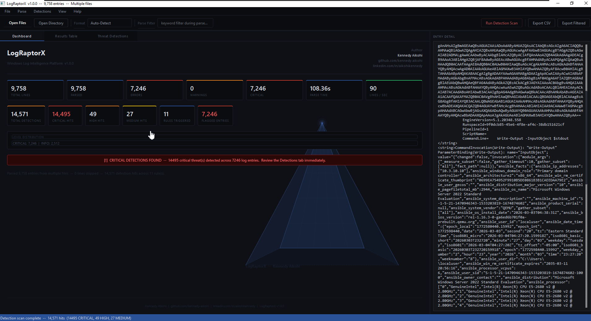

# LogRaptorX
### High-Performance Windows Log Intelligence Platform

Parse. Filter. Export. Fast.  
Multi-threaded log analysis with production-safe design.

**Developer:** Kennedy Aikohi  
**GitHub:** https://github.com/kennedy-aikohi  
**LinkedIn:** https://www.linkedin.com/in/aikohikennedy/  
**Version:** 1.0.0  

---

## Screenshot

---

## Features

- Multi-threaded parsing  - up to 8 worker threads
- Chunked I/O             - handles large files without memory issues
- Gzip support            - parse .gz compressed logs directly
- Auto format detection   - samples file header to identify format
- Security keyword flagging
- Real-time filter by level, keyword, security flag
- UTF-8 CSV export compatible with Excel and SIEM tools
- Drag and drop file/directory loading
- Paginated results table (500 rows per page, never freezes)

---

## Supported Formats

- Windows Event Log – text-exported .evtx/.evt
- Syslog RFC 3164 – classic BSD syslog
- Syslog RFC 5424 – structured syslog
- IIS / W3C – Microsoft IIS access logs
- Apache / NGINX – combined and common log formats
- PowerShell – ScriptBlock logging (Event 4104)
- Generic – any timestamped log file

---

## Build (Windows)

Requirements: Python 3.10+ (64-bit), Windows 10/11

  1. Extract LogRaptorX.zip
  2. Open PowerShell (NOT as Administrator)
  3. cd into the LogRaptorX folder
  4. Run: .\build_windows.bat
  5. Output: dist\LogRaptorX.exe

The EXE is standalone - no Python needed on the target machine.

---

## Run from Source

  pip install -r requirements.txt
  cd src
  python main.py

---

## CSV Output Columns

  Line#      - original line number in source file
  Timestamp  - extracted timestamp
  Level      - INFO, WARN, ERROR, CRITICAL, AUDIT-OK, AUDIT-FAIL
  Source     - host, service, or application name
  EventID    - Windows Event ID or HTTP status code
  Message    - parsed log message
  FilePath   - source file path
  Raw        - first 200 chars of raw log line

---

## Security Notes

  - Read-only operation, never modifies source files
  - No network access, fully offline
  - No admin rights required
  - Safe for production and DFIR environments

---

MIT License - Copyright 2024 Kennedy Aikohi
